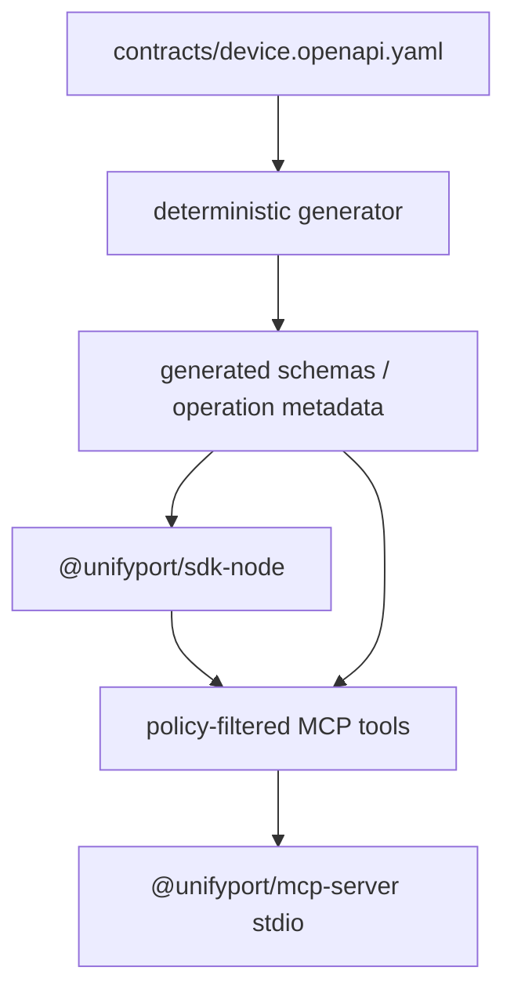

# 架构说明

## 目标与范围

本工作区把 Device API 的公开 HTTP 契约转换成 Node.js/TypeScript 可维护资产：

- `@unifyport/sdk-node`：面向应用代码的类型安全 SDK；
- `@unifyport/mcp-server`：在更严格的安全策略下，把允许的 SDK operation 暴露为 MCP tools；
- `skills/`：让自动化代理按同一套契约、生成和安全规则维护或使用 SDK。

公开契约没有定义的能力不进入 SDK。这个限制让公开类型、传输语义和安全策略始终能回到经批准的
API schema 与 release notes。

## 总体分层

每一层只有一个职责：契约描述 wire format，生成层消除手写 operation 漂移，SDK 处理传输与错误
语义，MCP 再施加模型调用所需的最小权限。MCP 不直接绕过 SDK 发 HTTP 请求。

## 契约治理

`contracts/device.openapi.yaml` 是代码生成的唯一协议输入。契约必须来自经批准的公开 API schema，
并结合 release notes 审查兼容性、安全和版本影响。

契约文件不能长期保留只服务于 SDK 的 wire protocol 补丁。若公开说明不完整，应先完成协议确认，
再更新契约；生成成功只证明结构可处理，不证明协议语义正确。

## SDK 结构

### 单一 Device API 客户端

公开入口提供：

- `UnifyPortDeviceClient` / `DeviceClientConfig`：通过 `X-Api-Key` 调用 Device API。

Device API 内的 `/v1/accounts/...` 是 provider 账号资源，包含账号管理、授权和运行态能力，仍由同一
Device client 提供。client 会把 API key 固定在配置的 origin/path 边界，避免认证材料被调用参数覆盖
或发送到错误地址。

### 生成 operation 与手写基础设施

operation path、method、请求参数和响应类型应从固定契约生成；传输、错误、认证、重试、分页策略和
客户端外观由经过测试的基础设施提供。生成文件必须有 generated 标记，并由
`pnpm generate:check` 验证可复现性。

公开方法应保持 operationId 稳定。契约中的 operationId 变化属于公开 SDK 命名变化，需要按破坏性
变更审查，不能依赖生成器静默重命名。

### 请求与响应

一次调用的逻辑顺序是：

1. 校验 base URL 与请求输入；
2. 由客户端注入认证，拒绝单次请求覆盖认证 header；
3. 合并 timeout 与调用方 `AbortSignal`；
4. 仅按 operation 策略执行安全重试；
5. 解析成功或标准/非标准错误体；
6. 返回类型化数据与必要的响应元数据，或抛出统一 SDK 错误。

成功结果保留 HTTP status、request ID 和底层 `Response`，便于直接调用方处理正常 header。公开错误只
保留筛选后的 status/code/request ID，不保存原始 `Response`、body、header 或 cause。错误解析必须
容忍空 body、非 JSON body 以及不完整的错误 envelope；解析失败不能掩盖原始 HTTP status。

### 重试与超时

默认重试只适用于策略明确允许的安全读取，并限制在网络失败或临时状态（例如 `408`、`429`、
`502`、`503`、`504`）。退避应尊重合法的 `Retry-After`，其余情况使用带上限的 jitter，避免多个
调用方同步重试放大故障。

普通写操作、没有幂等保证的创建/轮换以及提交账号授权验证码/密码/session 等行为不能自动重试。
即使 HTTP method 是 `GET`，也必须以 operation 策略而非 method 猜测副作用。

### JavaScript 整数边界

`uint64` 可以超过 `Number.MAX_SAFE_INTEGER`。ID、cursor 或计数值如果没有公开的安全范围保证，契约
与 SDK 必须把它们保留为字符串，或提供不会丢精度的显式表示。禁止在通用解析层把数字字符串自动
转换成 `number`。

### 分页

cursor 分页 helper 必须具有最大页数、重复 cursor 检测和 abort 支持。helper 只负责安全迭代，不应
隐藏业务筛选参数，也不应在调用方取消后继续预取。

## MCP 结构

MCP registry 从生成的 operation metadata 建立，每个 tool 对应一个固定 operation。不存在可接收任意
method、path、base URL 或认证 header 的通用工具。

operation policy 至少包含：

- `mutability`: `read` / `write` / `destructive`；
- `retryable`；
- `secretInput` / `secretOutput`；
- `mcpExposure`: `read` / `write` / `destructive` / `never`。

默认只暴露安全读取；write 和 destructive 分别需要显式开关。含 secret 或未知风险的 operation 使用
`never`。这些分类由生成 metadata 与 MCP registry 共用，避免文档、SDK 和工具列表
出现三套判断。

MCP Server 使用 stdio transport。`stdout` 仅承载 JSON-RPC，日志写入 `stderr`。base URL 与凭据只在
进程启动时配置，不进入 tool schema，也不能由模型覆盖。

## 包与发布边界

工作区使用两个 package：

- `@unifyport/sdk-node`：可独立用于 Node.js 应用；
- `@unifyport/mcp-server`：依赖 SDK，仅负责策略过滤、schema 验证和 MCP 协议适配。

发布包只包含 `dist`、package metadata 和最小 README。源码、开发配置、凭据与临时产物不能进入
tarball。构建后使用 `pnpm package:check` 验证 exports、声明文件和可执行权限。

公开交付必须额外运行 `pnpm public:check`。该门禁用于确认公开内容、契约路径和发布边界，不能由
构建成功或单元测试替代。

## 扩展原则

新增 API 的顺序是：

1. 确认经批准的公开 API schema 与 release notes；
2. 更新仓库内契约并运行 lint；
3. 为 operation 明确 auth、副作用、retry、secret、destructive 与 MCP 分类；
4. 重新生成类型、客户端方法与 tool metadata；
5. 添加边界测试和文档；
6. 运行 `pnpm check`、`pnpm generate:check` 与 `pnpm public:check`。

未知能力先保持不支持。forward-compatible 的核心是确定性契约和保守安全默认值，而不是提供可绕过
策略的 raw API 入口。
