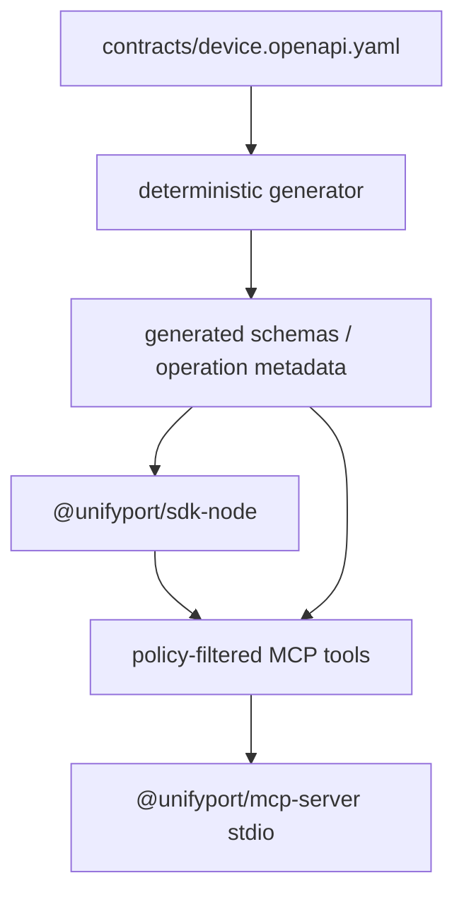

# Architecture

[English](architecture.md) | [简体中文](zh-CN/architecture.md)

## Goals and Scope

This workspace turns the public HTTP contract of the Device API into maintainable Node.js and TypeScript assets:

- `@unifyport/sdk-node`: a type-safe SDK for application code;
- `@unifyport/mcp-server`: an MCP server that exposes approved SDK operations as tools under stricter security policies;
- `skills/`: reusable instructions that keep automated maintenance and SDK usage aligned with the same contract, generation, and security rules.

A capability that is not defined by the public contract does not enter the SDK. This constraint keeps public types, transport semantics, and security policies traceable to an approved API schema and release notes.

## Layered Design

Each layer has one responsibility. The contract describes the wire format, generation removes hand-written operation drift, the SDK implements transport and error semantics, and MCP applies the least privilege required for model calls. MCP never bypasses the SDK to send HTTP requests directly.

## Contract Governance

`contracts/device.openapi.yaml` is the only protocol input to code generation. The contract must come from an approved public API schema and be reviewed with release notes for compatibility, security, and version impact.

The contract must not retain SDK-only wire protocol patches. If public documentation is incomplete, confirm the protocol first and then update the contract. Successful generation proves only that the structure can be processed; it does not prove that the protocol semantics are correct.

## SDK Structure

### One Device API Client

The public entry point provides:

- `UnifyPortDeviceClient` / `DeviceClientConfig`: calls the Device API with `X-Api-Key`.

Device API paths under `/v1/accounts/...` represent provider account resources, including account management, authorization, and runtime capabilities. They remain part of the same Device client. The client restricts the API key to the configured origin and path boundary so that operation input cannot override credentials or send them to the wrong destination.

### Generated Operations and Hand-Written Infrastructure

Operation paths, methods, request parameters, response types, API Reference pages, and example type checks are generated from the pinned contract. Tested infrastructure provides transport, errors, authentication, retry, pagination policy, and the public client facade. Generated files carry a generated marker and `pnpm generate:check` verifies reproducibility.

Public methods keep stable `operationId` values. Changing an `operationId` changes the public SDK method name and therefore requires breaking-change review; the generator must not silently rename it.

### Requests and Responses

Each call follows this logical sequence:

1. Validate the base URL and request input.
2. Inject authentication from client configuration and reject per-request authentication overrides.
3. Combine the timeout with the caller's `AbortSignal`.
4. Retry only when the operation policy explicitly permits it.
5. Parse a successful response or a standard/non-standard error body.
6. Return typed data and required response metadata, or throw a consistent SDK error.

A successful result retains the HTTP status, request ID, and underlying `Response`, allowing the direct caller to inspect normal response headers. A public error retains only filtered status, code, and request ID values; it does not retain the raw `Response`, body, headers, or cause. Error parsing tolerates an empty body, a non-JSON body, and an incomplete error envelope. A parsing failure must not hide the original HTTP status.

### Retry and Timeout

Automatic retry applies only to explicitly approved safe reads and is limited to network failures or temporary statuses such as `408`, `429`, `502`, `503`, and `504`. Backoff honors a valid `Retry-After`; otherwise it uses capped jitter so that concurrent callers do not amplify an outage with synchronized retries.

Normal writes, creates or rotations without idempotency guarantees, and account authorization submissions containing a verification code, password, or session payload are not retried automatically. Even when the HTTP method is `GET`, side effects must be determined by operation policy rather than inferred from the method.

### JavaScript Integer Boundaries

A `uint64` can exceed `Number.MAX_SAFE_INTEGER`. If the public contract does not guarantee a safe range, IDs, cursors, and counters remain strings or use another explicit lossless representation. The general response parser must not convert numeric strings to `number` automatically.

### Pagination

The cursor pagination helper enforces a maximum page count, detects repeated cursors, and supports abort. It performs safe iteration only: it does not hide business filters or continue prefetching after cancellation.

## MCP Structure

The MCP registry is built from generated operation metadata, and each tool maps to one fixed operation. There is no generic tool that accepts an arbitrary method, path, base URL, or authentication header.

Each operation policy includes at least:

- `mutability`: `read` / `write` / `destructive`;
- `retryable`;
- `secretInput` / `secretOutput`;
- `mcpExposure`: `read` / `write` / `destructive` / `never`.

Only safe reads are exposed by default. Write and destructive operations require separate explicit switches. Operations containing secrets or unknown risks use `never`. Generated metadata and the MCP registry share these classifications so that documentation, the SDK, and the tool list do not maintain three competing decisions.

The MCP server uses stdio transport. `stdout` carries JSON-RPC only, and logs go to `stderr`. The base URL and credentials are configured only at process startup. They do not enter a tool schema and cannot be overridden by the model.

## Package and Release Boundaries

The workspace contains two packages:

- `@unifyport/sdk-node`: the public npm package for Node.js applications;
- `@unifyport/mcp-server`: a private package that depends on the SDK and provides policy filtering, schema validation, and MCP protocol adaptation.

A package tarball contains only `dist`, package metadata, and the English and Simplified Chinese README files. Source files, development configuration, credentials, and temporary artifacts must not enter the tarball. After building, `pnpm package:check` validates exports, declaration files, executable permissions, and package contents.

Every public delivery also runs `pnpm public:check`. This gate verifies public content, contract paths, and release boundaries; a successful build or unit test cannot replace it.

## Extension Workflow

Add an API in this order:

1. Confirm the approved public API schema and release notes.
2. Update the repository contract and run its lint gate.
3. Classify authentication, side effects, retry, secrets, destructive behavior, and MCP exposure for the operation.
4. Regenerate types, client methods, documentation, and tool metadata.
5. Add boundary tests and documentation.
6. Run `pnpm check`, `pnpm generate:check`, and `pnpm public:check`.

Unknown capabilities remain unsupported. Forward compatibility comes from a deterministic contract and conservative security defaults, not from a raw API escape hatch that bypasses policy.
